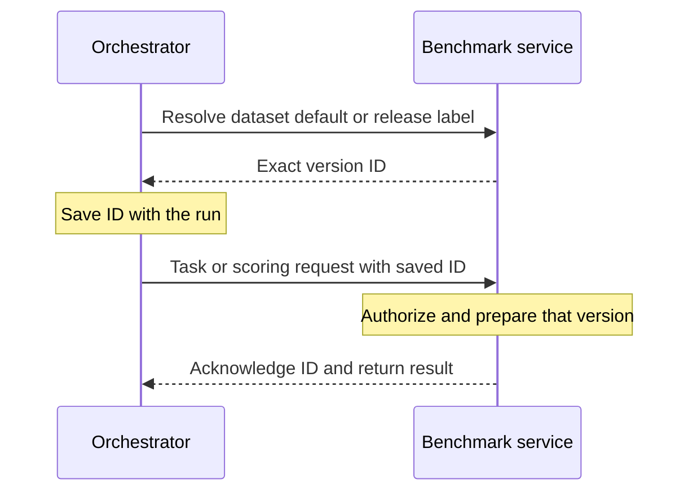

# Keep a run on one dataset version

A service can change its default dataset while a run is in progress. Resolve the default once, save the returned version ID with the run, and send that ID on every later request. Retries and final scoring must use the saved ID too.

This feature is optional. It works with local files, a database, or a separate dataset store. A version ID is an opaque string: the client stores and sends it without interpreting its format.



## Client workflow

```python
from benchmark_service import BenchmarkServiceClient

async with BenchmarkServiceClient(service_url, headers) as client:
    metadata = await client.version(dataset="validation")
    if not metadata.dataset_version_pinning:
        raise RuntimeError("This service cannot pin dataset versions")
    selected = await client.resolve_dataset("validation")

# Save selected.dataset and selected.version with the run before dispatching tasks.
async with BenchmarkServiceClient(
    service_url, headers, dataset_version=selected.version.id
) as client:
    tasks = await client.verify_task_ids(None, None, dataset=selected.dataset)
```

Pass `version="v1.0"` to `resolve_dataset` to select a fixed release. Omitting it selects the service's configured default. The protocol defines no `latest` alias. A label alone from `/version` does not establish support for pinning.

Keep the dataset name and service URL with the version ID. IDs belong to that service and dataset; another service may use the same string for different data. A client pin cannot change during its lifetime. Create another client for another version.

## Implement the service hooks

Override `supports_dataset_version_pinning(dataset)` and `open_dataset_version(dataset, version)`. The latter is an async context manager that yields a `DatasetVersion(id=..., label=...)`. Both model fields are required; `label` can be `None`.

The framework checks dataset access before entering this context. The context must select and prepare the data, then keep it available until the operation finishes. Existing task, grading, and scoring methods keep their signatures. They read the selected data through request-local state, such as a `ContextVar` used by `get_dataset()`.

```python
@asynccontextmanager
async def open_dataset_version(self, dataset, version):
    selected = version or self.default_versions[dataset]
    data = self.immutable_releases[dataset][selected]
    token = self.request_data.set(data)
    try:
        yield DatasetVersion(id=selected, label=selected)
    finally:
        self.request_data.reset(token)
```

This sketch assumes the service has initialized immutable releases and a request-local variable. A service can retain just one release and reject older IDs. It must never substitute its current default for an unavailable requested version.

Do not replace shared `self.datasets` during a request: concurrent requests can select different versions. Keep task order, task contents, grading data, and versioned assets fixed for an ID. If preparation uses a worker thread, cancellation must wait for that worker before releasing its resources. WebSocket disconnection cancels the operation, including preparation.

Use `HTTPException` to report an unavailable version (404), an incompatible version (409), or temporary storage failure (503). Authorization still applies to a pinned request. A pin is not permission to read the data.

## Wire contract

| Operation | Contract |
| --- | --- |
| `GET /version?dataset=validation` | `dataset_version_pinning: true` declares support for that dataset. Existing services report false. |
| `POST /resolve-dataset` | Authenticated body: `{"dataset":"validation","version":null}`. Returns `{"dataset":"validation","version":{"id":"v1.0","label":"v1.0"}}`. Trial tenants can resolve datasets they may access. No evaluation quota is consumed. |
| Dataset HTTP requests | Send `X-Benchmark-Dataset-Version: v1.0`. Successful responses echo it. The client rejects a missing or different echo. |
| Dataset WebSocket requests | Send the same header. Before any handler work, the server emits `{"type":"dataset_version","data":{"id":"v1.0","label":"v1.0"}}`. The client consumes it before exposing progress, checkpoints, or results. |

If version selection fails on a pinned WebSocket request, the framework sends `{"type":"dataset_version_error","data":{"status_code":404,"detail":"Dataset version unavailable"}}` before any version acknowledgement. The status identifies invalid or unsupported selection (400), an unavailable version (404), an incompatible version (409), or a temporary storage failure (503). The framework client raises `BenchmarkServiceError` with that `status_code`. It never retries without the pin. Access denial keeps the existing WebSocket policy close.

The task-list response uses the selected version's display label for a pinned request. The acknowledgement and HTTP response header carry the exact ID. `/version?dataset=...` continues to report the service's configured label, which can differ from a saved pin.

Benchmark-owned `error` chunks retain their existing string payload and can be followed by more chunks, including a `result`. The framework client treats an `error` as a failed operation and closes its socket. A service stream that has more work after an error must handle cancellation and finish its cleanup when that client disconnects.

The header covers task verification, retrieval, setup, all evaluation paths, scoring, and `/v1` task listing and upload preparation. `/health` and `/version` remain metadata operations. Resolution rejects a version header; its selector belongs in the body.

IDs contain 1–1,024 visible ASCII characters with no whitespace. Display labels contain up to 256 Unicode characters. Resolution selectors can contain Unicode and spaces, so a service can map a release name to its exact ID. Duplicate headers are rejected. Browser deployments must allow and expose `X-Benchmark-Dataset-Version` in their CORS policy.

Requests without a pin keep their existing response and stream shapes. Supporting services select their default independently for each such request. An explicit pin on a service without support fails instead of being ignored.

## Rollout and limits

Upgrade every service replica before sending pinned traffic. Old framework versions may ignore the header; the client detects their missing acknowledgement, but an old handler may already have performed work.

The framework does not save run state or choose how long versions are retained. The orchestrator saves the selection and reuses it after restart and retry. If a saved version is removed, recovery fails. Pinning data does not freeze evaluator code, model behavior, or an agent's environment.
